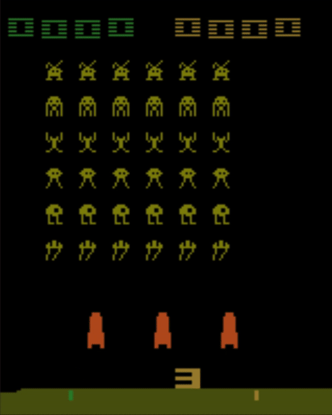
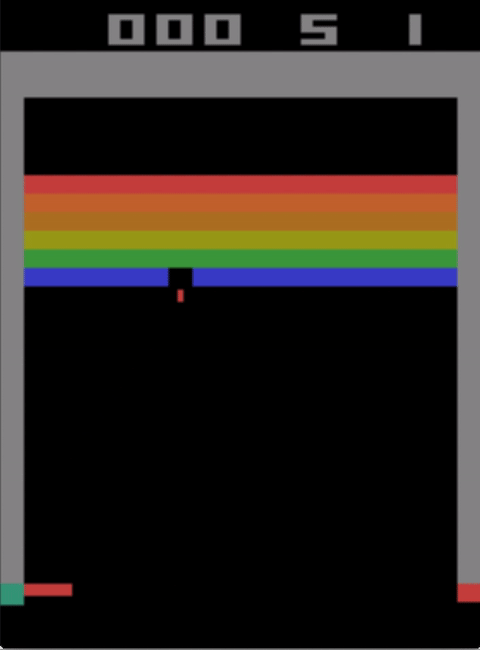
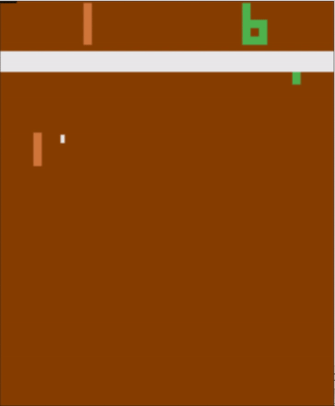
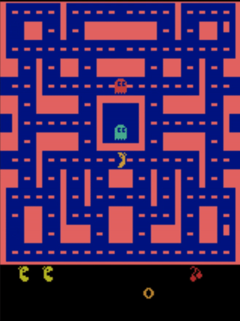
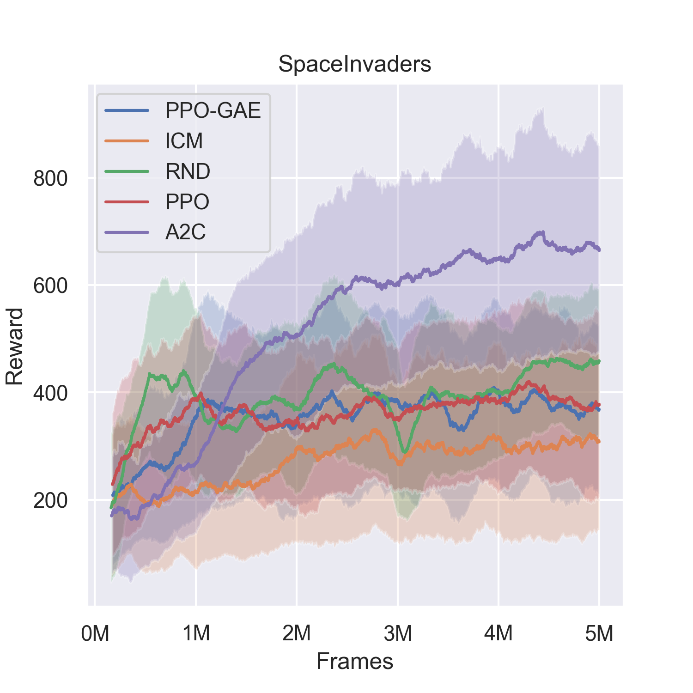
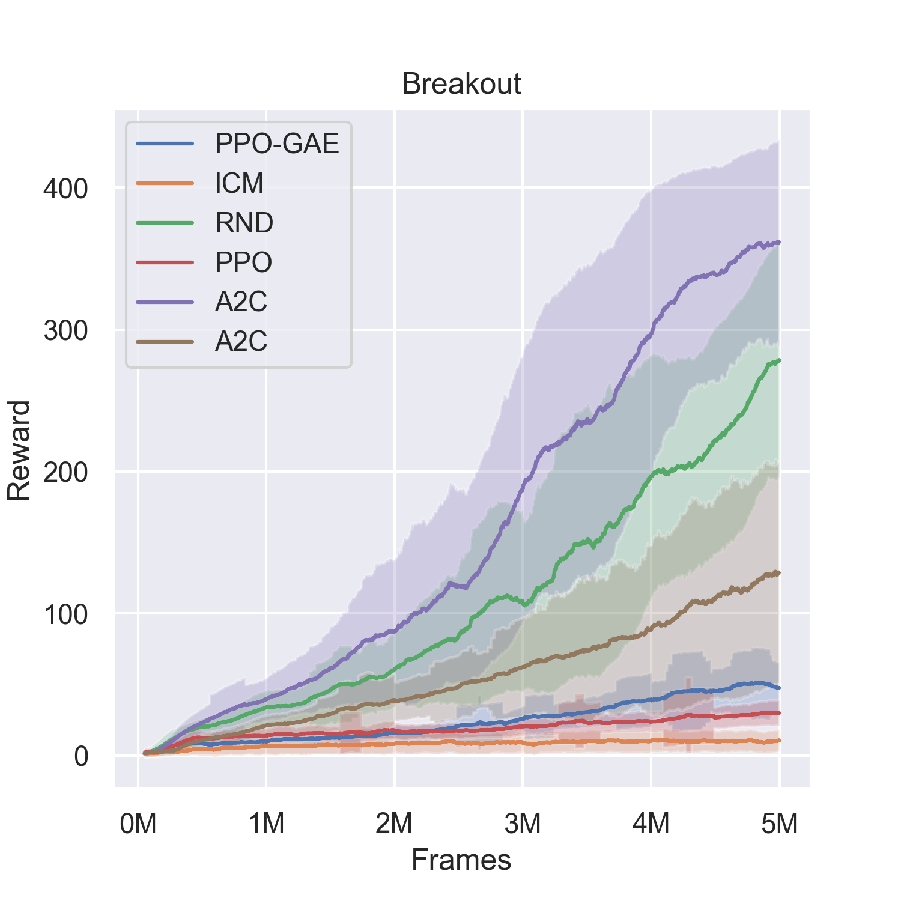
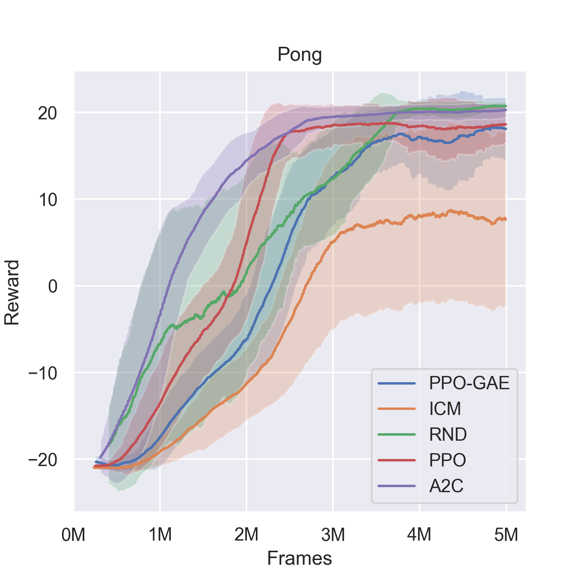
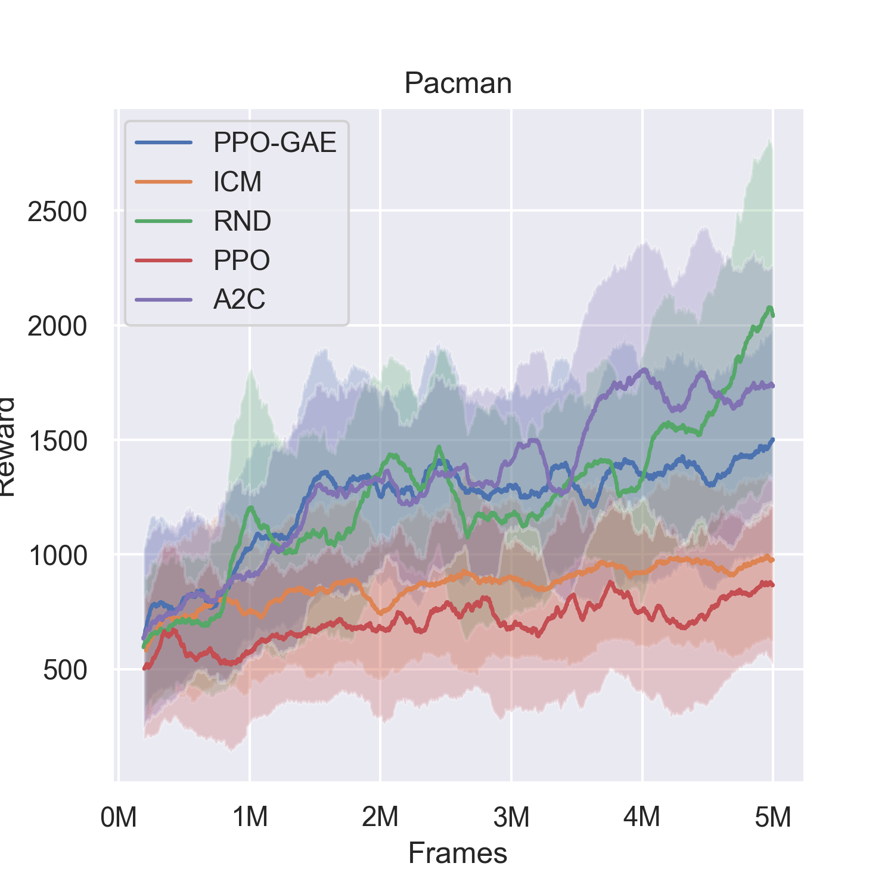
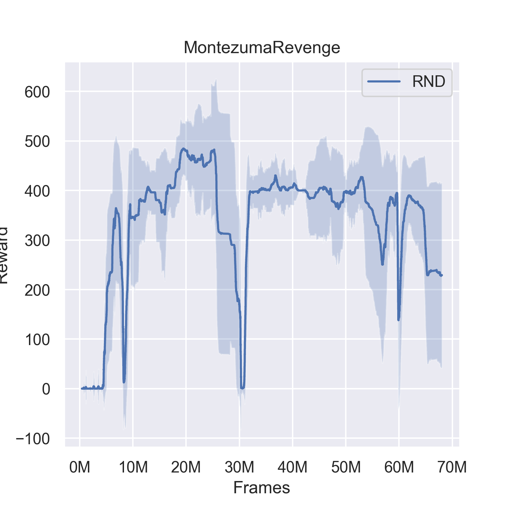

This repository contains the code produced over the course of my (Harry Songhurst) final year BSc computer science project at The University of Manchester. The aim of this project was to understand the landscape of RL algorithms, and to bring myself up to speed with the research in curiosity-driven RL.

To this end, I implemented the following algorithms in notebooks: `REINFORCE`, `DQN`, `A2C/A3C`, `PPO`, `PPO-GAE`, `ICM`, `RND`.

All notebooks are concise, self-contained experiments, most of which have been run for 5M frames (\~4500 weight updates for PPO based algos, 120K weight updates for A2C due to rollout length) to produce a trained agent on the Atari games `Pong`, `SpaceInvaders`, `Pacman`, `Breakout`, `BankHeist`, `MontezumaRevenge`. All notebooks work in Colab out of the box, with one additional dependency (`stable-baselines==2.9.0`). 

Also included are a few utilities for watching trained agents play (`./Animating`), plotting algorithm comparisons (`./Plotting`), as well as some research (discussed in my thesis) that looks into extracting an explicit "self model" from the environment (`./AutoEncoders`).

	
	
	
	

	
	
	
	

	

List of notebooks and scripts:

	.
	├── A2C
	│   ├── Bank Heist
	│   │   └── A2C_Atari_Bankheist.ipynb
	│   ├── Breakout
	│   │   ├── A2C_Atari_Breakout.ipynb
	│   │   └── A2C_Atari_Breakout_128.ipynb
	│   ├── MontezumaRevenge
	│   │   └── A2C_Atari_Montezuma.ipynb
	│   ├── Pacman
	│   │   └── A2C_Atari_Pacman.ipynb
	│   ├── Pong
	│   │   └── A2C_Atari_Pong.ipynb
	│   └── Space Invaders
	│       └── A2C_Atari_Space_Invaders.ipynb
	├── Animating
	│   ├── Animate.ipynb
	│   └── Animate.py
	├── AutoEncoders
	│   ├── AutoEncoder (latent 256, 4 frame).ipynb
	│   ├── Simple Autoencoder (one to one).ipynb
	│   ├── UNet (128-dim latent, action injected into latent, 1 frame).ipynb
	│   ├── UNet (256 dim latent, action first, 4 frame).ipynb
	│   ├── UNet (256-dim, 4 frame, action in latent).ipynb
	│   ├── UNet (32 dim latent, 1 frame, action in middle).ipynb
	│   ├── UNet (64 dim latent, action all layers, 1 frame).ipynb
	│   ├── UNet (64 dim latent, action middle, 4 frame) .ipynb
	│   ├── UNet (64-dim latent, 4 frame).ipynb
	│   ├── UNet (64-dim latent, action at all layers, 4 frame).ipynb
	│   └── UNet one to one.ipynb
	├── DQN
	│   ├── DQN_CartPole.ipynb
	│   └── dqn_cartpole.py
	├── ICM
	│   └── ICM_Atari_Breakout.ipynb
	├── PPO
	│   ├── BankHeist
	│   │   └── PPO_Atari_BankHeist.ipynb
	│   ├── Breakout
	│   │   └── PPO_Atari_Breakout.ipynb
	│   ├── Pacman
	│   │   └── PPO_Atari_Pacman.ipynb
	│   ├── Pong
	│   │   └── PPO_Atari_Pong.ipynb
	│   └── SpaceInvaders
	│       └── PPO_Atari_SpaceInvaders.ipynb
	├── PPO-GAE
	│   ├── BankHeist
	│   │   └── PPO-GAE_Atari_BankHeist.ipynb
	│   ├── Breakout
	│   │   └── PPO-GAE_Atari_Breakout.ipynb
	│   ├── Pacman
	│   │   └── PPO-GAE_Atari_Pacman.ipynb
	│   ├── Pong
	│   │   └── PPO-GAE_Atari_Pong.ipynb
	│   └── SpaceInvaders
	│       └── PPO-GAE_Atari_SpaceInvaders.ipynb
	├── Plotting
	│   ├── Comparison.ipynb
	│   └── Result_Plotting.ipynb
	├── REINFORCE
	│   ├── REINFORCE_CartPole.ipynb
	│   └── reinforce_cartpole.py
	└── RND
	    ├── BankHeist
	    │   └── RND_Atari_BankHeist.ipynb
	    ├── Breakout
	    │   └── RND_Atari_Breakout.ipynb
	    ├── Montezuma
	    │   └── RND_Atari_Montezuma.ipynb
	    ├── Pacman
	    │   └── RND_Atari_Pacman.ipynb
	    ├── Pong
	    │   └── RND_Atari_Pong.ipynb
	    └── SpaceInvaders
	        └── RND_Atari_SpaceInvaders.ipynb

If you find any mistakes let me know. If you wish to ask me anything about my work then please do. It would put a smile on my face to help anyone out!
